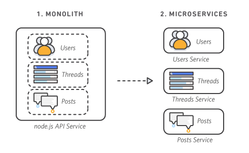

## Microservice architecture

**微服務 ( Microservices ) 是一種軟體架構，它是以專注於單一責任與功能的小型功能區塊 ( Small Building Blocks ) 為基礎，利用模組化的方式組合出複雜的大型應用程式，各功能區塊使用與語言無關 ( Language-Independent/Language agnostic ) 的 API 集相互通訊。**
> form [Microservices wiki](https://zh.wikipedia.org/wiki/%E5%BE%AE%E6%9C%8D%E5%8B%99)

從軟體專案的發展與歷程來解讀，應用程式初期設計在人力、時程、需求有限時，會採用 Monolithic 方向規劃，而這也是多數應用程式專案範本、教學容易說明與解釋的方式；然而，這樣的設計會因為應用程式的開發人力、期程、需求擴大，使 Monolithic 走向巨型應用程式，導致開發成果出現過度相依、重複設計、技術基礎不同等問題，進而使得開發時程不斷消耗在除錯、修補間。

而從 Monolithic 轉換為 Microservice 架構的作法，可謂基於軟體工程的分而治之 ( divide and conquer ) 法則而來，就已傳統單機應用程式 ( PC Application ) 來說，採用動態連結函式庫 ( Dynamic-link library、DLL )、插件架構 ( [Plug-in architectire](https://medium.com/omarelgabrys-blog/plug-in-architecture-dec207291800) 同樣符合概念；而網頁應用程式 ( Web Application ) 的 Monolithic 除了原始需求外，還必須考量三層式架構 ( 3-tier architecture ) 、負載平衡架構 ( load balance architecture)、持續整合與交付 ( Continuous Integration/Continuous Delivery ) 等基於規劃與效率的架構，因此即便是簡單的 Monolithic 也遠比在單機應用程式複雜，也基於這點考量才孕育出 Microservice 架構。

### Monolithic & Microservice

> from [什麼是微型服務？ - AWS](https://aws.amazon.com/tw/microservices/)

| 特性 | Microservice | Monolithic |
| :-: | :----: | :----: |
| 單位設計	| 此應用程式包含鬆耦合的服務。每項服務都支援單一商業工作。	| 整個應用程式都是以單一單位設計、開發和建置。
| 功能重複使用	| 微服務定義向任何從屬端顯示其功能的 API。從屬端甚至可以是其他應用程式。	| 跨應用程式重複使用功能的機會受到限制。
| 應用程式內的通訊	| 若要彼此通訊，應用程式的微服務會使用要求-回應通訊模型。典型的實行使用以 HTTP 協定為基礎的 REST API 呼叫。	| 內部程序 (函數呼叫) 有助於應用程式元件之間的通訊。不需要限制內部程序呼叫的數目。
| 技術靈活性	| 每個微服務都可以使用最適合微服務所設計解決問題的程式設計語言和架構來開發。	| 通常會以單一程式設計語言撰寫整個應用程式。
| 資料管理	| 分散式：每個微服務都可以使用自己的資料庫。	| 集中：整個應用程式使用一或多個資料庫。
| 佈署	| 每個微服務都會獨立部署，而不會影響應用程式中的其他微服務。	| 不過，任何變更需要重新建置並重新啟動整個應用程式。
| 維護性	| 微服務是簡單、集中且獨立的服務。因此，應用程式更容易維護。	| 當應用程式範圍增加時，維護代碼會變得更複雜。
| 復原能力	| 應用程式功能會分配至多個服務。如果微服務失敗，其他微服務所提供的功能仍可使用。	| 任何元件的失敗都會影響整個應用程式的使用狀態。
| 擴展性	| 每個微服務都可以獨立於其他服務之外進行擴展。	| 整個應用程式必須調整規模，即使業務需求僅適用於應用程式的特定部分。
> Reference from [瞭解微服務架構 - Oracle Cloud](https://docs.oracle.com/zh-tw/solutions/learn-architect-microservice/index.html#GUID-BDCEFE30-C883-45D5-B2E6-325C241388A5) and [Microservices, Martin Fowler and James Lewis, 2014](https://martinfowler.com/articles/microservices.html)

### Service architecture

#### Defined

+ Service could be replace by other.
+ Service organization by functional or business logic.
+ Service could be difference language and database.
+ Service relationship is not hierarchy.
+ Work with Continuous Delivery.

Microservice Architecture is not [Service-Oriented Architecture](https://zh.wikipedia.org/wiki/%E9%9D%A2%E5%90%91%E6%9C%8D%E5%8A%A1%E7%9A%84%E4%BD%93%E7%B3%BB%E7%BB%93%E6%9E%84), Microservice is an application, SOA is a service which integration multiple application.

#### Design

+ Interface
    - HTTP
    - AMQP
    - TCP
+ Storage
    - Database
    - Cache
+ Communication
    - Event Store
    - Message Queue
+ Encapsulation
    - Docker

#### 參考

+ [Microservices wiki](https://zh.wikipedia.org/wiki/%E5%BE%AE%E6%9C%8D%E5%8B%99)
    - [瞭解微服務架構 - Oracle Cloud](https://docs.oracle.com/zh-tw/solutions/learn-architect-microservice/index.html#GUID-BDCEFE30-C883-45D5-B2E6-325C241388A5)
    - [什麼是微型服務？ - AWS](https://aws.amazon.com/tw/microservices/)
    - [走入軟體架構演進史　見證微服務發展今昔](https://www.netadmin.com.tw/netadmin/zh-tw/technology/1716C14FB29749B68D8E74C93ACA6263)
